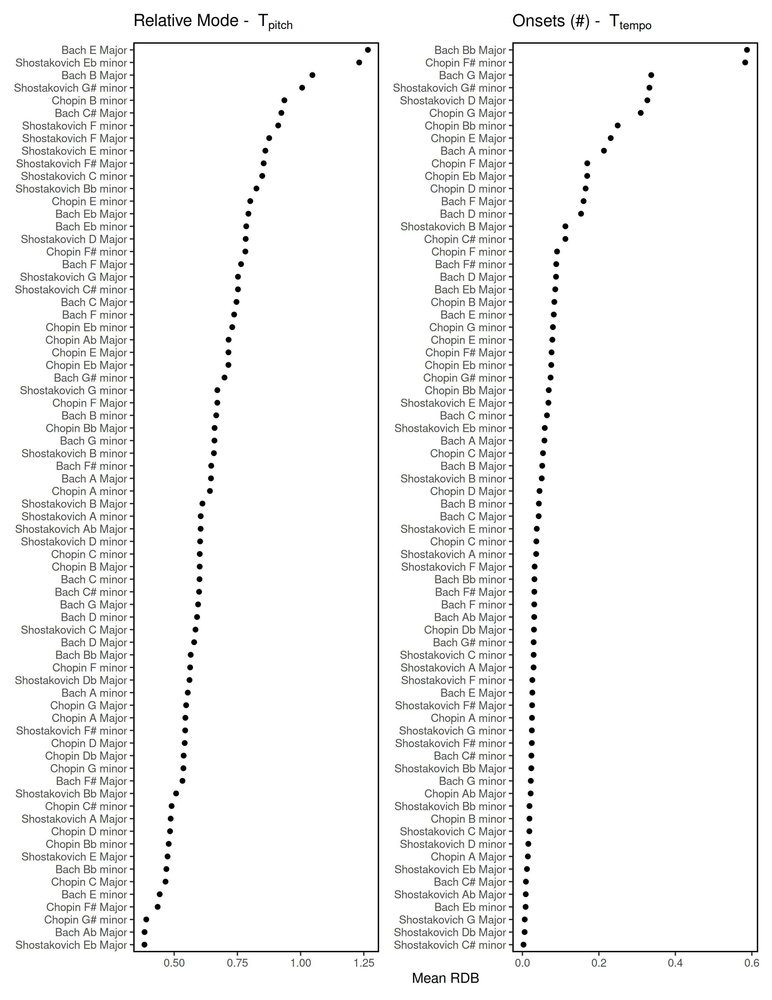

This repository contains reproducible data, results, and analysis from Swierczek & Schutz (in review) in Psychology of Music.

## Abstract

The quality of features extracted from audio files is critical as they are often treated as reliable stand-ins for the underlying musical properties they predict. It is particularly important to ensure robustness, the stability of a feature to irrelevant changes in the input (e.g., the predicted tempo of a piece of music should not be influenced by audio compression). We present a method for evaluating the robustness of audio features that does not rely on measuring accuracy, which can be difficult or impossible to measure for complex and subjective musical properties like tonality. We procedurally altered the tempo, dynamics, and pitch height of 72 MIDI representations of classical piano preludes, synthesized them with a basic piano soundfont and analyzed those audio files with relative mode and onset detection algorithms from three prominent music content analysis tools. We compared features extracted from unaltered audio files to those extracted from altered files, offering a metric of robustness regardless of their accuracy. Pairwise tests reveal greater instability to changes in pitch height and tempo, and greater robustness to changes in dynamics. We also find that predictions of relative mode result in non-monotonic relationships with the degree of alteration.

## Results

![Figure 2: Mean SDB for each combination of tool, extracted feature, and transformation. Each point is the mean SDB across all 72 preludes at a given level of a transformation (plotted with 95% bootstrap confidence intervals, r = 10,000). Each level of the transformation is plotted in order from most extreme negative on the left (e.g., -7 semitones) to most extreme positive on the right (e.g., +7 semitones) with the baseline value in the center. Spearman's rho between level and mean deviation from baseline is included at the top of each cell (p < 0.001 = ***, p < 0.01 =** , p < 0.05 =* ).](img/figure_2.png)

![Figure 4: A comparison of the extracted values from four preludes for two combinations of feature, tool, and transformation. A shows the the effect of T~pitch~ on relative mode extracted by Essentia, and B shows the effect of T~tempo~ on onset detection performed by Essentia. Horizontal lines and filled dots correspond to the untransformed, or baseline audio file. Each unfilled dot represents a specific value of the transformation, with the x axis representing the level of that transformation. Vertical lines are proportional to the degree of deviation from the baseline value.](img/figure_4.png)

## Expanding This Approach

Coming Soon!
